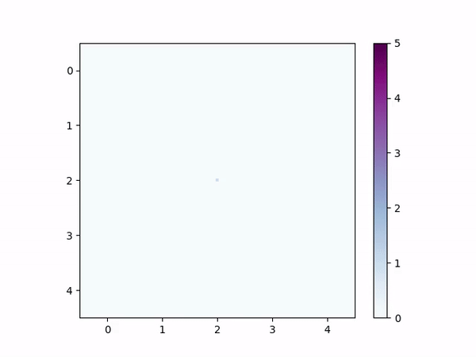
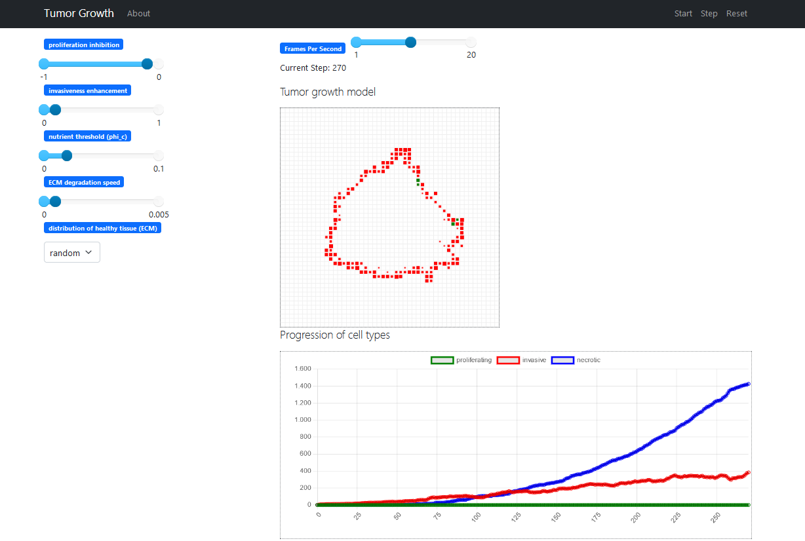

# Agent-Based Tumor Growth


Project on ABM tumor growth for the Agent-Based Modeling course at the UvA 2023-2024 (group 15).

We present an agent-based tumor growth model grounded in the [Mesa](https://mesa.readthedocs.io/en/stable/) framework. Simulations can  be run via the CLI or interactively in the browser. Results are visualized with animations and/or plots and can be saved to csv for further analysis. The model is based on [this paper](https://www.nature.com/articles/srep17992) by Chen et al. and was expanded by adding a Voronoi tesselation to the underlying tissue distribution.

## Installation
To get started, clone the repository and install the required packages: 
```bash
git clone https://github.com/Ninavd/tumor-dynamics-abm.git
cd tumor-dynamics-abm
pip install -r requirements.txt
```

If you want to be able to save animations of your simulation, you might need to install [FFmpeg](https://www.ffmpeg.org/download.html), which can not be installed using `pip`. It is easiest to install on Linux/WSL or Homebrew via

```bash
brew install ffmpeg
```
or 
```bash
sudo apt install ffmpeg
```

## Running an interactive Simulation
To launch an interactive version of the model, execute `mesa runserver` or `python server.py` in the root directory of the project. This opens an interface in your browser, allowing for interactive simulations on a fixed 50x50 grid. Invasive agents are colored red, while proliferating agents are colored green. The size of the squares corresponds to the number of agents in that grid cell.



We recommend increasing the fps slider to at least 10 fps to speed up the visualisation. 

Several growth parameters can be adjusted with the sliders on the left hand side:
* Proliferation inhibition ($\alpha_{pp}$): Controls to what degree proliferation is favorable, default value is -0.1
* Invasiveness enhancement ($\beta_{ii}$): Controls to what degree invasiveness is favorable, default is 0.1
* Nutrient threshold ($\phi_c$): If the local nutrient concentration drops below this value, all agents at that location will die (become necrotic). Increasing this value may cause the initial cell population to die before significant growth is established. 
* ECM degradation speed ($\gamma$): How fast the tumor cells degrade healthy tissue. Increasing this value will significantly impact radial growth speed of the tumor. 
* Distribution of the ECM: Density field of healthy tissue, can choose between a random distribution or a Voronoi tessellation.

More information on these parameters can be found in the [original paper by Chen et al.](https://www.nature.com/articles/srep17992) or can be read in our report on request. 


## Running via the CLI
```
usage: main.py [-h] [-s SEED] [-api ALPHA_PI] [-app ALPHA_PP] [-bii BETA_II] [-bip BETA_IP] [--voronoi] [--summary] [--save]
               [--show_plot] [--animate]
               n_steps L_grid

Simulate agent-based tumor growth and save results

positional arguments:
  n_steps               max number of time steps used in simulation
  L_grid                Width of grid in number of cells

options:
  -h, --help            show this help message and exit
  -n N                  How many simulations to run. If > 1, averaged results are saved
                        to csv. Default is 1.
  -s SEED               Seed of simulation (default is random)

  -api ALPHA_PI         proliferative probability change when 
                        encountering an invasive cell (default is -0.02).      

  -app ALPHA_PP         proliferative probability change when 
                        encountering an proliferative cell (default is -0.1).

  -bii BETA_II          invasive probability change when encountering 
                        an invasive cell (default is 0.1). 

  -bip BETA_IP          invasive probability change when encountering an
                        proliferative cell (default is 0.02).   

  --voronoi             Initialize ECM grid as voronoi diagram instead of
                        random.
  --summary             print summary of simulation results.
  --save                store simulation object in pickle file.
  --show_plot           show plots of final tumor and other parameters.
  --animate             save animation video of simulated tumor growth.
```

**example**
```bash
python main.py 1000 100 -s 2 --show_plot --summary
```
Runs one simulation for 1000 iterations on a 100x100 grid, with seed 2. Once the simulation is finished, plots are shown of the tumor and other statistics and a summary of the simulation is printed.

## Repository structure
```
├── main.py     # CLI implementation
├── server.py   # Running an interactive simulation
├── tumor/
│   ├── __init__.py
│   ├── classes/
│   │   ├── __init__.py
│   │   ├── collect_averages.py             # Class for averaging over multiple runs
│   │   ├── tumor_cell.py                   # Agent class
│   │   ├── tumor_growth.py                 # Model class
│   │   ├── tumor_visualization_helper.py   # Class for calculating several statistics
│   │   └── tumor_visualizations.py         # Class for plotting visualizations and statistics
│   ├── helpers.py                          # Helper functions
│   ├── sensitivity_analysis.py             # Sensitivity analysis
│   └── sensitivity_analysis_csv_only.py    # Plotting the results of SA
├── save_files/                             # Simulation results are stored here
└── videos/                                 # Animations are saved here
```
